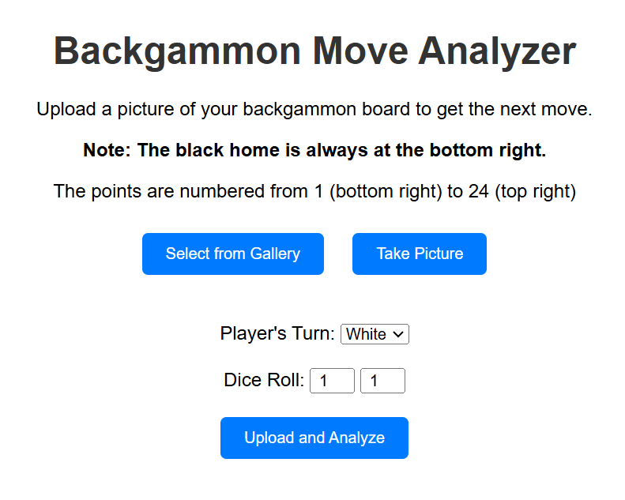
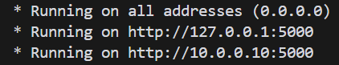
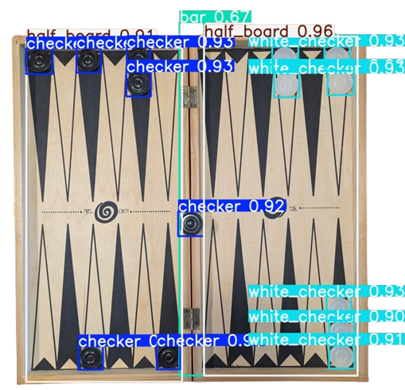

# BackGamon Analyzer



## Description
This project integrates GNU Backgammon, YOLOv5, and a Flask-based web application to analyze, detect, and process backgammon board states and improve gameplay insights. The project uses machine learning and computer vision to detect board states and compute accurate positions for backgammon pieces.  
You can read more about the project in my [Medium story](https://medium.com/@nitzankolatacz/fb541ec1c0e5).

## Features
- Backgammon State Analysis: Set up the board state and perform analyses using GNU Backgammon.
- Board Detection: Use YOLOv5 to detect and normalize coordinates of checkers within each quarter of the backgammon board.
- Web Interface: A Flask web application for interacting with the AI, uploading images, and retrieving board states.


## Installation
1. Clone the repository:
   ```bash
   git clone https://github.com/nitzankoll/backGammon-analyzer.git
   cd backGamon-analyzer
   ```

2. Install dependencies:
   ```bash
   pip install -r requirements.txt
   ```

3. Install GNU Backgammon
-Download GNU Backgammon from the official website.
-Follow the installation instructions for your operating system.
-Ensure GNU Backgammon is in your system’s PATH.

## Usage
1. Run the Flask server:
   ```bash
   python server.py
   ```

2. Access the web interface at `http://127.0.0.1:5000`.
	1. if you want to run on your locall network see the server.py print for the url.
   

3. Upload images of backgammon boards for analysis.  
	board detection example:
	
   

## File Structure
/project_directory
│  
├── backGammon.py          # Handles backgammon-specific processing  
├── server.py              # Flask web server  
├── requirements.txt       # Python dependencies  
├── .gitignore             # Git ignore file  
├── README.md              # Project documentation  
├── model.pt               # custom yolov5 model  
└── index.html             # HTML file for Flask  


## Contributing
Feel free to submit issues or contribute via pull requests.

## License
This project is licensed under the [MIT License](LICENSE).

## Acknowledgments
- [GNU Backgammon](https://www.gnu.org/software/gnubg/)
- [YOLOv5](https://github.com/ultralytics/yolov5)
